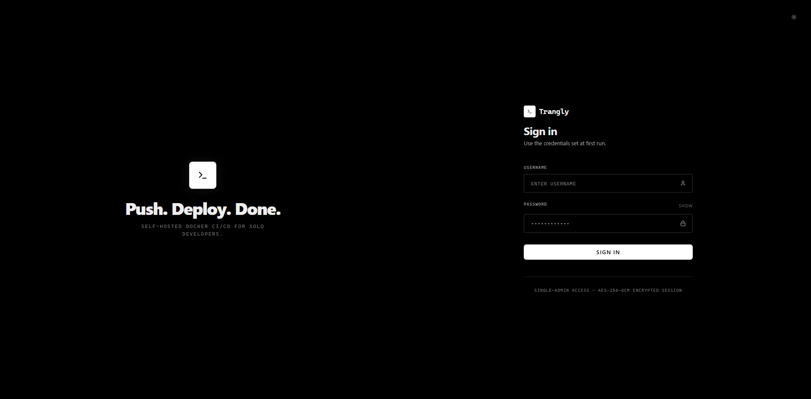
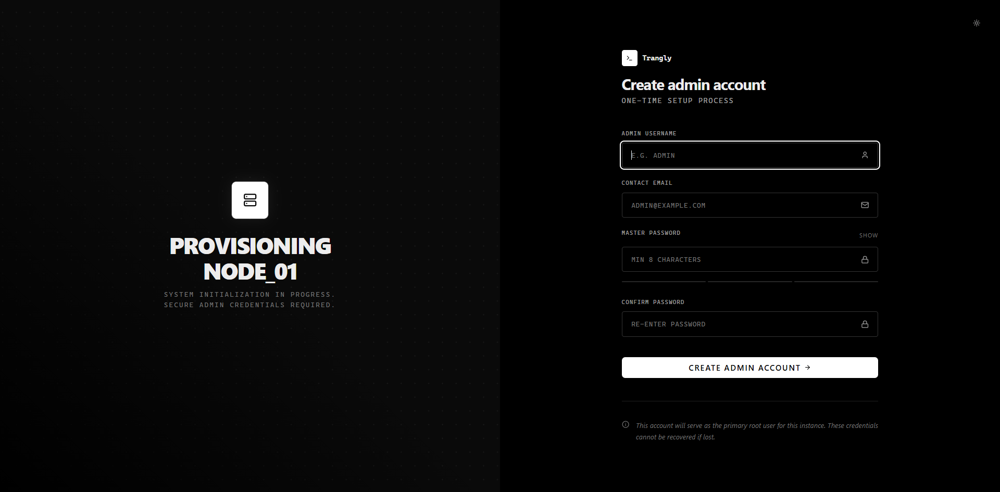
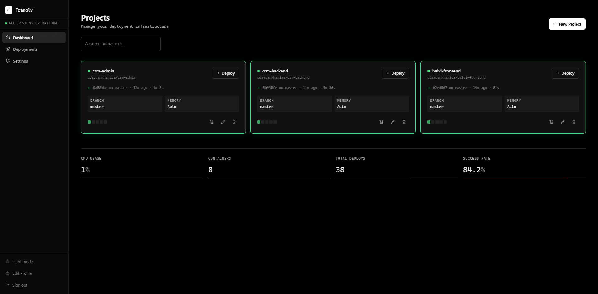
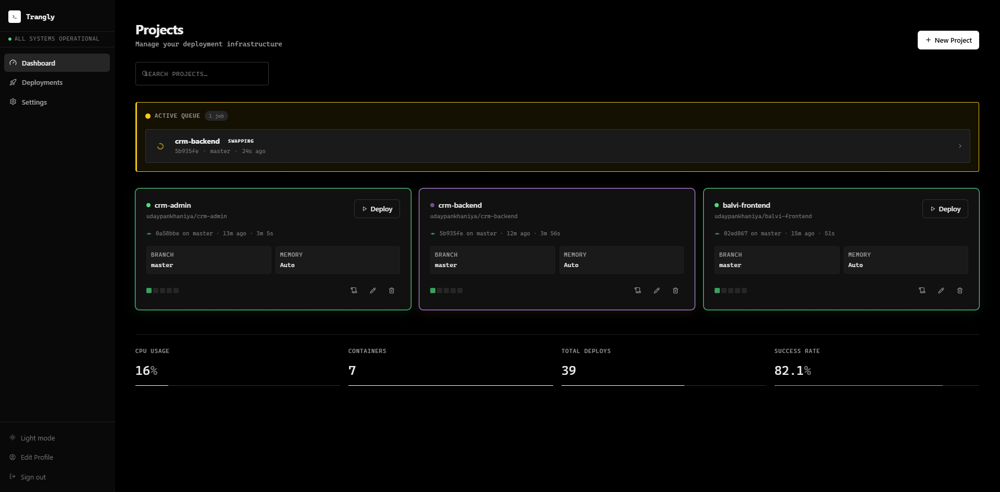
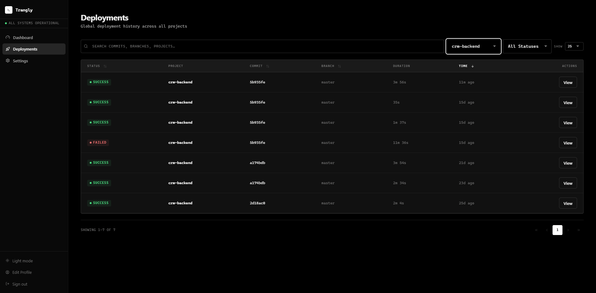
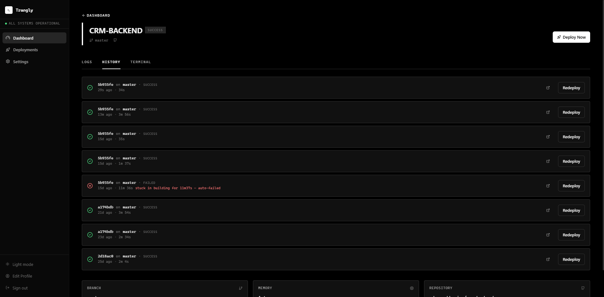
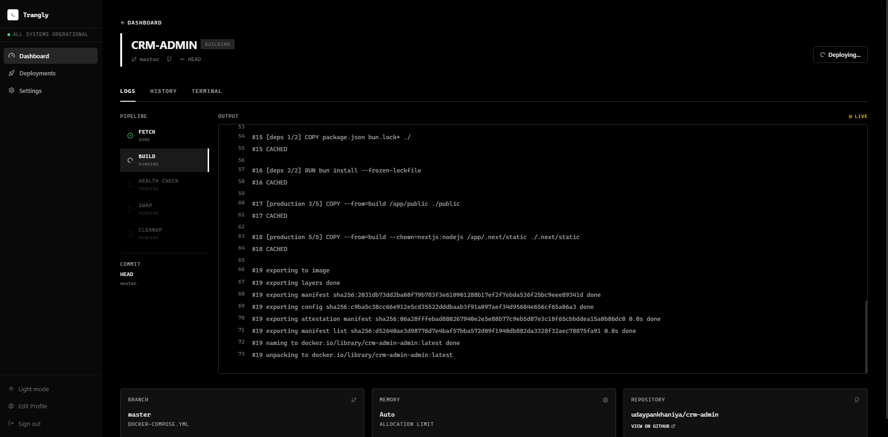
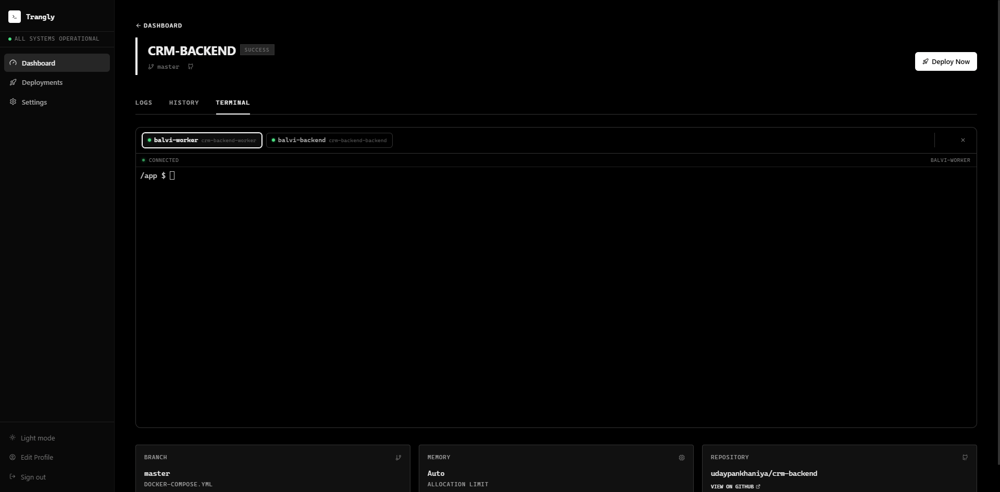
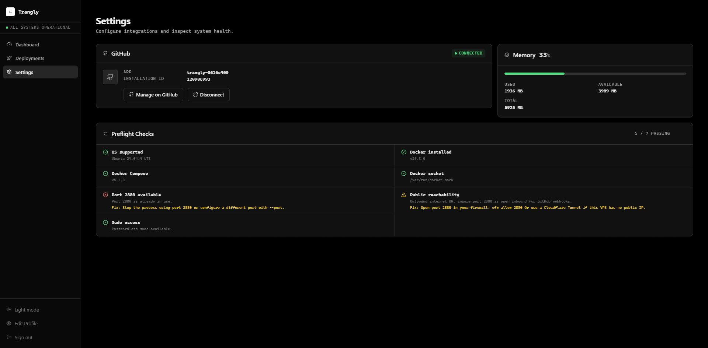

# Trangly

> **Push to GitHub. Watch it deploy. That's the whole thing.**

Trangly is a self-hosted, single-binary CI/CD tool for developers who run Docker apps on a VPS. It watches your GitHub repo, rebuilds your app on every push, and swaps in the new container only after it passes a health check — with zero YAML, zero cloud accounts, and zero DevOps setup.

[](https://github.com/udaypankhaniya/trangly/releases)
[](LICENSE)
[](https://go.dev/)

---

## Who Is This For?

Trangly is built for developers who:

- Run a **Docker app on a VPS** (DigitalOcean, Hetzner, Linode, bare metal — anything)
- Want **push-to-deploy** without managing GitHub Actions workflows or YAML pipelines
- Are tired of **Coolify / Dokku / CapRover** adding complexity they don't need
- Want something that **just works** and stays out of the way

If that's you, Trangly installs in under two minutes and has you deploying from GitHub in under five.

---

## How It Works

```
git push origin main
  └─▶ GitHub webhook fires
        └─▶ Trangly queues a deploy job
              └─▶ git clone → docker compose build → health check → swap → done
```

Old production keeps running through every step until the new build passes its health check. The swap is the last thing that happens — not the first.

---

## Why Not Just Use...

| Tool | The Real Problem |
|---|---|
| **GitHub Actions** | Requires YAML expertise, cloud configuration, and you're still SSH-ing in for anything non-trivial |
| **Coolify / CapRover** | Opinionated, heavy, and often pull in more infrastructure than a side project needs |
| **Dokku** | Git-push model is elegant but fights you once you have a custom Compose setup |
| **Manual deploys** | No health checks, no failure protection, and one bad push takes down production |
| **Trangly** | One binary on your server. Connect GitHub. Add a project. Done. |

---

## Features

- **Two-click GitHub App setup** — GitHub's App Manifest flow; no copy-pasting tokens or configuring webhooks
- **Health-gated swap** — old container stays alive through build; swapped only after the health check passes, so a bad build never touches production
- **Rebuild and hot-swap modes** — full `docker compose build` pipeline for most projects; file-copy hot-swap for interpreted-language apps that don't need a rebuild
- **RAM-aware scheduler** — computes your VPS's available budget at startup; holds jobs instead of letting deploys OOM your machine
- **Web terminal** — SSH-like terminal access to your server directly from the Trangly dashboard; no separate SSH client needed
- **Live log streaming** — real-time stdout/stderr over Server-Sent Events; no polling, no page refresh
- **Auto-detect health check** — parses your Compose file to determine HTTP, TCP, or no-probe mode automatically
- **SQLite-backed queue** — per-project FIFO queue persisted to disk; survives restarts, no external database
- **Single binary** — ships as `.deb` / `.rpm` for Linux; no Node.js, no Python, no runtime dependencies

---

## Real-World Benefits

**Deploys are fast.** `git clone --depth=1` + `docker compose build` + instant swap. No action runner spin-up time, no artifact upload/download, no queue wait on a shared cloud runner.

**Your VPS won't OOM.** Trangly measures available RAM at startup and refuses to start a deploy it can't safely run. You get a held job warning in the dashboard, not a crashed server.

**Setup takes minutes, not hours.** No Kubernetes. No Helm charts. No cloud IAM. Install the binary, run `trangly setup`, click Connect GitHub, add a project.

**Failure is safe by default.** A failed build never touches your running container. Only a passing health check triggers the swap — and if the swap itself fails, the error is surfaced immediately.

---

## Screenshots

### Sign In



### First Run Setup



### Dashboard





### Deployments



### Project



### Live Logs



### Terminal



### Settings



---

## Deploy Pipeline

Trangly supports two pipeline modes, chosen per project:

### Rebuild Mode (default)

```
FETCH        git clone --depth=1 the commit SHA
  │
BUILD        docker compose build  (logs stream live)
  │          ← old container still running
  │
HEALTH CHECK auto-detected: HTTP probe / TCP probe / none
  │          ← old container still running
  │
SWAP         compose down (30s) → compose up -d (120s)
  │          ← first and only moment production is affected
  │
CLEANUP      remove workspace; prune dangling images; emit success
```

**Failure before SWAP** → job marked failed, old production untouched.

### Hot-Swap Mode

For apps that don't need a full rebuild (Python, Node.js, PHP, static files):

```
FETCH     →  HOT_SWAP (file copy into running container)  →  CLEANUP
```

No downtime. No container restart. Updated files land in the running container directly.

---

## Quick Start

### 1. Install on your VPS

**One-liner (Debian / Ubuntu / RHEL / Fedora / Alpine):**
```bash
curl -fsSL https://raw.githubusercontent.com/udaypankhaniya/trangly/master/scripts/install.sh | sh
```

**Or download a package directly from the [v0.1.2 release](https://github.com/udaypankhaniya/trangly/releases/tag/v0.1.2):**

| Platform | Architecture | Download |
|---|---|---|
| Debian / Ubuntu | amd64 | [trangly_0.1.2_amd64.deb](https://github.com/udaypankhaniya/trangly/releases/download/v0.1.2/trangly_0.1.2_amd64.deb) |
| Debian / Ubuntu | arm64 | [trangly_0.1.2_arm64.deb](https://github.com/udaypankhaniya/trangly/releases/download/v0.1.2/trangly_0.1.2_arm64.deb) |
| RHEL / Fedora / CentOS | amd64 | [trangly-0.1.2-1.x86_64.rpm](https://github.com/udaypankhaniya/trangly/releases/download/v0.1.2/trangly-0.1.2-1.x86_64.rpm) |
| RHEL / Fedora / CentOS | arm64 | [trangly-0.1.2-1.aarch64.rpm](https://github.com/udaypankhaniya/trangly/releases/download/v0.1.2/trangly-0.1.2-1.aarch64.rpm) |
| Linux (raw binary) | amd64 | [trangly-linux-amd64](https://github.com/udaypankhaniya/trangly/releases/download/v0.1.2/trangly-linux-amd64) |
| Linux (raw binary) | arm64 | [trangly-linux-arm64](https://github.com/udaypankhaniya/trangly/releases/download/v0.1.2/trangly-linux-arm64) |
| Windows | amd64 | [trangly-windows-amd64-v0.1.2.zip](https://github.com/udaypankhaniya/trangly/releases/download/v0.1.2/trangly-windows-amd64-v0.1.2.zip) |
| Windows | arm64 | [trangly-windows-arm64-v0.1.2.zip](https://github.com/udaypankhaniya/trangly/releases/download/v0.1.2/trangly-windows-arm64-v0.1.2.zip) |

```bash
# Debian / Ubuntu — amd64
curl -LO https://github.com/udaypankhaniya/trangly/releases/download/v0.1.2/trangly_0.1.2_amd64.deb
sudo dpkg -i trangly_0.1.2_amd64.deb

# Debian / Ubuntu — arm64
curl -LO https://github.com/udaypankhaniya/trangly/releases/download/v0.1.2/trangly_0.1.2_arm64.deb
sudo dpkg -i trangly_0.1.2_arm64.deb

# RHEL / Fedora / CentOS — amd64
curl -LO https://github.com/udaypankhaniya/trangly/releases/download/v0.1.2/trangly-0.1.2-1.x86_64.rpm
sudo rpm -U trangly-0.1.2-1.x86_64.rpm

# RHEL / Fedora / CentOS — arm64
curl -LO https://github.com/udaypankhaniya/trangly/releases/download/v0.1.2/trangly-0.1.2-1.aarch64.rpm
sudo rpm -U trangly-0.1.2-1.aarch64.rpm
```

### 2. Run setup

```bash
trangly setup
```

Creates the admin account and runs the preflight checklist: Docker version, Compose V2 plugin, socket access, port availability, and public reachability.

### 3. Open the dashboard

Navigate to `http://your-vps-ip:2880`.

### 4. Connect GitHub and add a project

1. Click **Connect GitHub** — two clicks, no copy-pasting, uses GitHub's App Manifest flow
2. Click **Add Project** — select your repo, branch, and Compose file path
3. Push to GitHub — watch the deploy run live

---

## System Requirements

| Requirement | Minimum |
|---|---|
| OS | Ubuntu 20.04+, Debian 11+, CentOS 8+, Fedora 36+, Alpine 3.18+ |
| Docker | 20.x or later |
| Docker Compose | V2 CLI plugin (2.x) |
| RAM | 512 MB free (Trangly itself uses < 35 MB idle) |
| Network | VPS must be publicly reachable on port 2880 (or via Cloudflare Tunnel) |

---

## Configuration

All state is stored in `~/.trangly/`:

```
~/.trangly/
  config.db         SQLite: projects, deploy jobs, users, queue, GitHub App credentials
  master.key        AES-256 encryption key (chmod 600; never logged)
  github-app.pem    GitHub App private key (AES-256-GCM encrypted at rest)
  workspaces/       Temporary git clones (deleted after each deploy)
  logs/             Per-deploy stdout+stderr log files
```

Override the data directory or port at runtime:
```bash
trangly start --data-dir /opt/trangly --port 2880
```

---

## CLI Reference

```
trangly setup            Interactive first-run wizard
trangly start            Start the server (default port 2880)
trangly check            Run preflight checks and print results
trangly install          Register as a systemd service (requires sudo)
trangly uninstall        Remove systemd service
trangly reset            Factory reset — deletes DB, master key, logs, and workspaces
trangly version          Print version, commit SHA, and build date
```

---

## Development

### Prerequisites

- Go 1.22+
- Docker with Compose V2
- `sqlc` (for schema changes): `go install github.com/sqlc-dev/sqlc/cmd/sqlc@latest`
- `golangci-lint` (for linting): see [golangci-lint install](https://golangci-lint.run/usage/install/)

### Build & Run

```bash
# Clone
git clone https://github.com/udaypankhaniya/trangly.git
cd trangly

# Tidy dependencies
go mod tidy

# Run in development mode (data stored in ./dev-data)
make run

# Interactive first-run setup
make setup
```

### Common Make Targets

```bash
make build      # Build binary for current platform → dist/trangly
make test       # Run all tests with race detector
make cover      # Tests + HTML coverage report
make lint       # golangci-lint
make clean      # Remove dist/ and dev-data/
make release    # Build linux/amd64 + linux/arm64 binaries
make deb        # Build .deb packages (requires nfpm)
make rpm        # Build .rpm packages (requires nfpm)
make packages   # Build .deb + .rpm + .apk for amd64 and arm64
```

**Windows:**
```powershell
.\scripts\build-windows.ps1   # Build Windows .exe for current arch
.\scripts\build.ps1           # Build all platforms + packages
```

### Architecture

See [docs/STRUCTURE.md](docs/STRUCTURE.md) for the full package layout and dependency rules.

```
API → Queue → Scheduler → Engine → Pipeline
```

| Layer | What it does |
|---|---|
| **Control plane** | HTTP handlers, auth, project config — never executes deploys directly |
| **Execution plane** | Queue, scheduler, engine, pipeline — never touches HTTP |
| **Domain** | Pure Go structs, zero external dependencies |
| **Infra** | All I/O: Docker SDK, SQLite, GitHub API, Git |

---

## Security

| Concern | Implementation |
|---|---|
| Passwords | bcrypt, cost 12 |
| Session tokens | HS256 JWT, random 32-byte secret per installation, 24-hour expiry |
| Secrets at rest | AES-256-GCM; master key derived with Argon2id (t=1, m=64MB, p=4) |
| Webhook validation | HMAC-SHA256 constant-time check on every `/webhooks/github` request |
| State tokens | 32 random bytes, single-use, 10-minute expiry |
| Rate limiting | 60 req/min per IP on webhook endpoint; 5 req/min per IP on login |
| Security headers | CSP, X-Frame-Options: DENY, nosniff, Referrer-Policy on all responses |

See [SECURITY.md](SECURITY.md) to report a vulnerability.


---

## Contributing

Issues, feature requests, and pull requests are welcome.

- **Found a bug?** Open an issue with steps to reproduce.
- **Have a feature idea?** Open a discussion before sending a large PR — it's worth aligning on the approach first.
- **Want to contribute code?** Check [CONTRIBUTING.md](CONTRIBUTING.md) for the code style guide, test requirements, and PR process.

The codebase is deliberately small and focused. Good contributions improve reliability, reduce complexity, or close a clear gap — they don't add scope.

---

## License

MIT — see [LICENSE](LICENSE).
